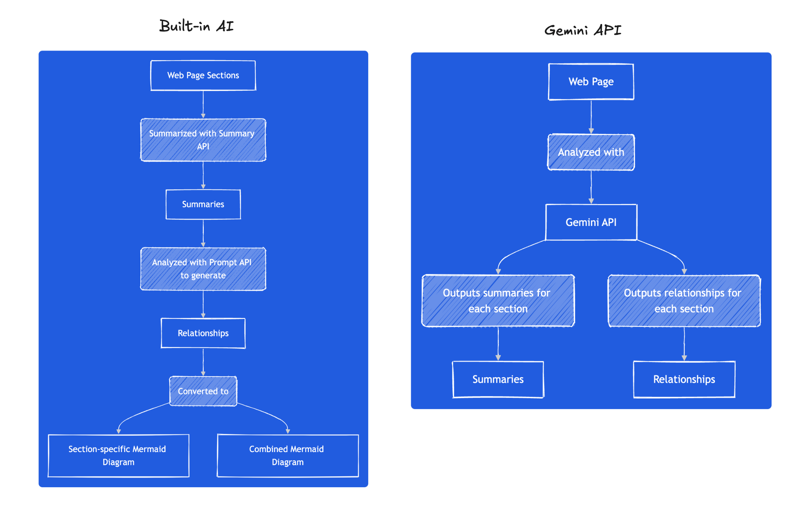
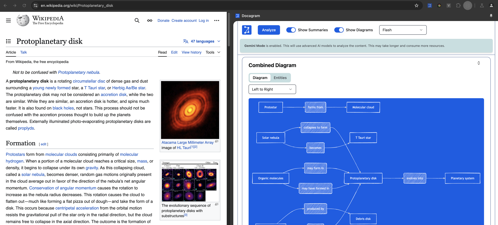

# Overview

Docagram uses Chrome's built-in AI to help you visualize content on the web. It uses the Summarization and Prompt APIs to extract relationships from text content and then converts those relationships into [Mermaid diagrams](https://mermaid.js.org/).






# Built-In AI

This project uses the following APIs:
- [Prompt API](https://docs.google.com/document/d/1VG8HIyz361zGduWgNG7R_R8Xkv0OOJ8b5C9QKeCjU0c/edit?tab=t.0)
- [Summarization API](https://docs.google.com/document/d/1Bvd6cU9VIEb7kHTAOCtmmHNAYlIZdeNmV7Oy-2CtimA/edit?tab=t.0)
- [Writer and Rewriter APIs](https://docs.google.com/document/d/1WZlAvfrIWDwzQXdqIcCOTcrWLGGgmoesN1VGFbKU_D4/edit?pli=1&tab=t.0) (Doesn't work, using Prompt API instead)

All docs for the built-in AI APIs can be found [here](https://docs.google.com/document/d/18otm-D9xhn_XyObbQrc1v7SI-7lBX3ynZkjEpiS1V04/edit?tab=t.0).

# Setup

Enable the following flags in Chrome:
- chrome://flags/#optimization-guide-on-device-model
- chrome://flags/#prompt-api-for-gemini-nano
- chrome://flags/#summarization-api-for-gemini-nano
- chrome://flags/#writer-api-for-gemini-nano
- chrome://flags/#rewriter-api-for-gemini-nano

To optionally use the Gemini Pro model for analyzing pages, add a `.env` file at the root of your project with the following key:

```
VITE_GOOGLE_API_KEY=
```

# Development

Run the following to have Vite rebuild the project on all changes:

```bash
npm run dev
```

In Chrome Canary, load the unpacked extension from the `/dist` folder. 

# Want to build a Chrome Extension?

This repository demonstrates how to create a Chrome extension using React, TypeScript, TailwindCSS, and Vite.

More details can be found in this blog post:

https://joemuller.com/posts/create-a-chrome-extension-with-react-typescript-and-tailwindcss/